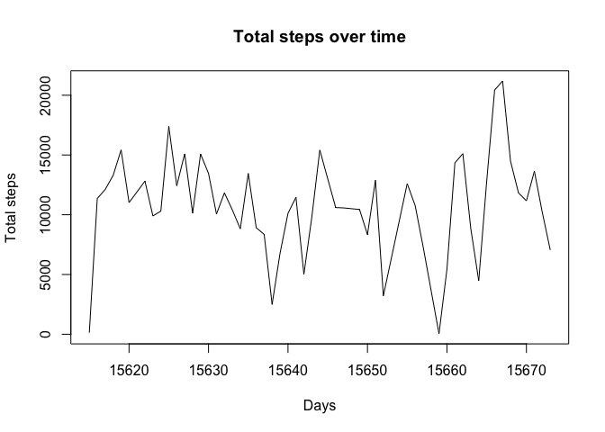
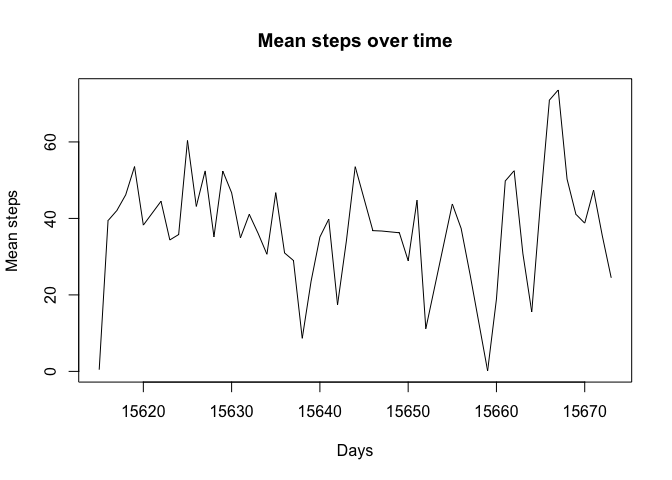
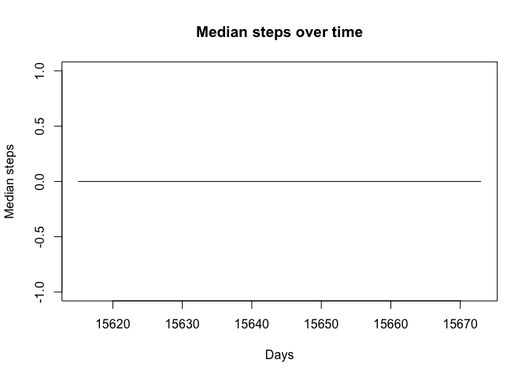
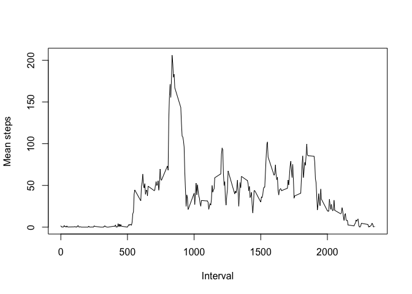
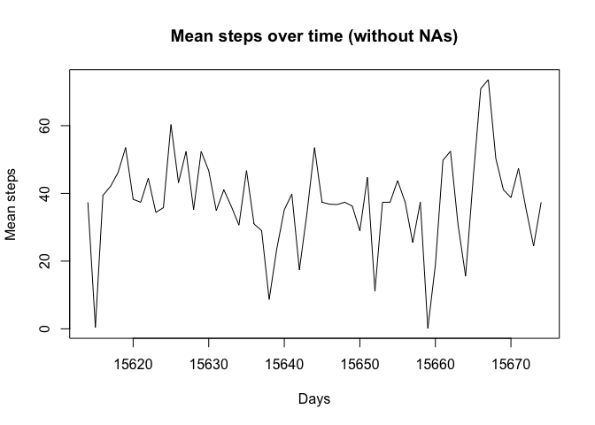
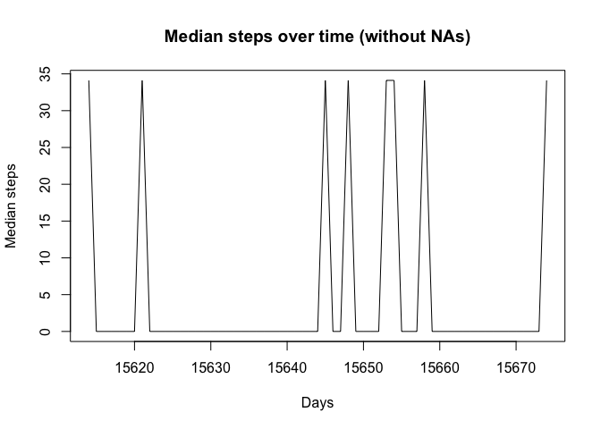
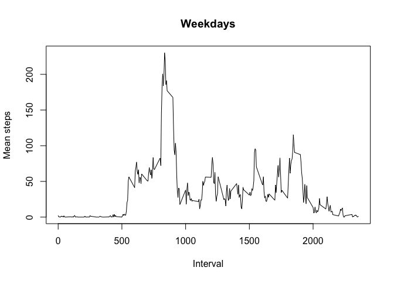
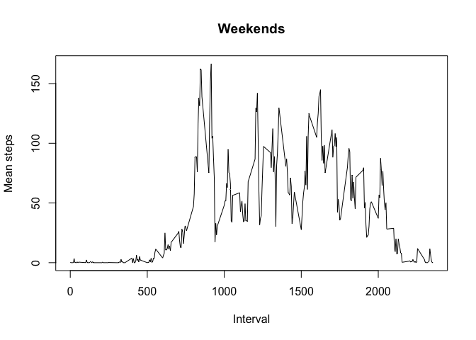

# Reproducible Research: Peer Assessment 1


## Loading and preprocessing the data

Data data is provided inside the [activity.zip](activity.zip) file.

Note: To extract the contents in Mac OS you my use `$ unzip activity.zip`.

The document is reasonably well formatted, as such, we may loaded it with the appropriate classes before hand:


```r
rawData <- read.csv("activity.csv", colClasses = c("numeric", "Date", "numeric"))
```

## What is mean total number of steps taken per day?

The total number of days may be determined as such:


```r
stepsSum <- aggregate(steps ~ date, rawData, sum)
```

 

Although we use `barplot` to plot the graphic `Total steps over time`, this graph is a histogram over the days the data refers to.

Lets also look at the `mean` and `median`:


```r
stepsMean <- aggregate(steps ~ date, rawData, mean)
```

 


```r
stepsMedian <- aggregate(steps ~ date, rawData, median)
```
 

We notice that the `median` of the number of steps taken is `0`, which looks rather odd.

## What is the average daily activity pattern?

The interval frequencies mean is the following:


```r
stepsIntervals <- aggregate(steps ~ interval, rawData, mean)
```

Visualizing this data as a timeseries we get:

 

Which allows us to also determine the interval of the day with the maximum number of steps on average:


```r
stepsIntervals[stepsIntervals$steps == max(stepsIntervals$steps),]$interval
```

```
## [1] 835
```

## Imputing missing values

The observed results are using unknown data underneath. To assess the number of entries missing data may be determined as such:


```r
length(rawData[is.na(rawData$steps),]$steps)
```

```
## [1] 2304
```

To fill in the gaps we'll use the mean per interval of the known values.


```r
getIntervalMeans <- function(intervalList, intervalMeans) {
  result <- vector()
  for (i in intervalList) {
    result <- c(result, intervalMeans[intervalMeans$interval == i,]$steps)
  }
  result
}
rawCopy <- rawData
rawCopy[is.na(rawCopy$steps),]$steps <- getIntervalMeans(rawCopy[is.na(rawCopy$steps),]$interval, stepsIntervals)
```

The mean and median now show:


```r
copyMean <- aggregate(steps ~ date, rawCopy, mean)
```

 


```r
copyMedian <- aggregate(steps ~ date, rawCopy, median)
```
 

We notice that the `mean` is considerably similar. This is due to the fact that we use the original mean as the default value for `NA` entries.

The `median` however shows very different values because now there are many more entries with values compared to the vast majority of either `0` or `NA` entries before.

## Are there differences in activity patterns between weekdays and weekends?

Looking at the data based on weekdays and weekends we have the following:


```r
rawCopy$weekday <- ifelse(as.POSIXlt(rawCopy$date)$wday %in% c(0,6), 'weekend', 'weekday')
```


```r
weekdayMean <- aggregate(steps ~ interval, rawCopy[rawCopy$weekday == "weekday",], mean)
weekendMean <- aggregate(steps ~ interval, rawCopy[rawCopy$weekday == "weekend",], mean)
```
  

We can conclude that the subject walked more evenly during the weekend compared to the weekdays
